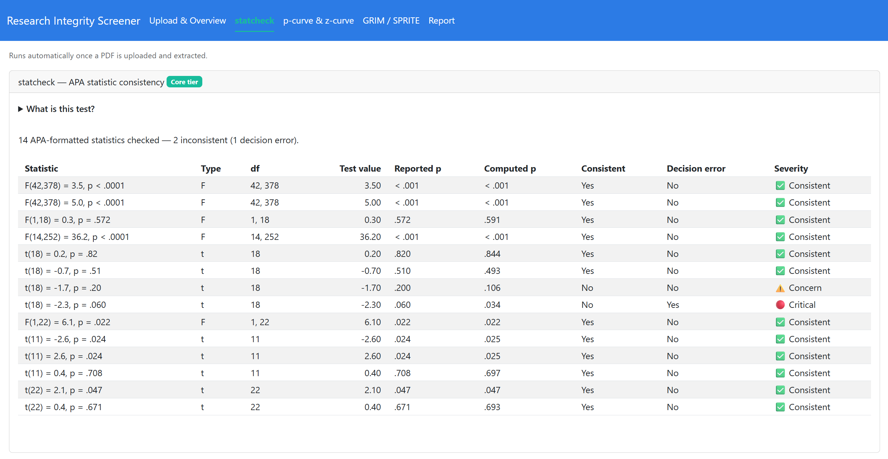
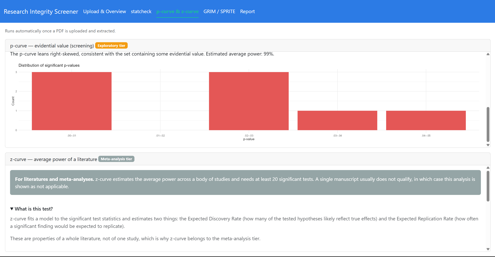
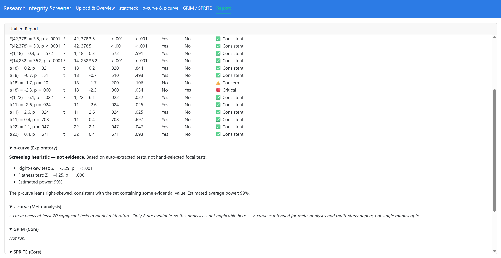

# Research Integrity Screener (RIS)

### ▶︎ [Launch the live app](https://aimunna.shinyapps.io/research-integrity-screener/)

[](https://aimunna.shinyapps.io/research-integrity-screener/)

An R Shiny web application that runs statistical consistency checks on quantitative
research manuscripts and produces a unified integrity-screening report. It wraps five
established integrity-testing methods - **statcheck, p-curve, z-curve, GRIM, and
SPRITE** - behind one accessible interface.

> **Flagged results indicate potential inconsistencies warranting further examination -
> not evidence of misconduct.** No single automated flag is sufficient grounds for an
> editorial decision or an allegation.

---

## What it does

Upload a PDF (or enter values by hand) and RIS screens the reported statistics for
internal inconsistencies, returning a traffic-light summary and a downloadable report.

### Reliability tiers

Not every test is equally reliable on a single manuscript, so each is labelled by tier
and the overall signal is driven by the **Core** tier only:

| Tier | Tests | Meaning |
|---|---|---|
| 🟢 **Core** | statcheck, GRIM, SPRITE | Reliable on a single paper; drive the integrity signal |
| 🟠 **Exploratory** | p-curve | A screening heuristic only (uses auto-extracted, not hand-picked focal tests) |
| ⚪ **Meta-analysis** | z-curve | For literatures/meta-analyses; usually *not applicable* to one paper |

### Applicable papers

Designed for **quantitative psychology, medicine, social science, and educational
measurement** - papers that report classical significance tests (`t`, `F`, `χ²`, `z`, `r`).
It is **not** applicable to pure ML/CS, theoretical, or qualitative papers (which report
no such statistics); RIS simply reports "no statistics detected" for those.

---

## Walkthrough

### 1. statcheck - APA statistic consistency (Core)

Recomputes each reported p-value from its test statistic and degrees of freedom, then
flags mismatches. A **decision error** (the mismatch crosses the .05 threshold) is marked
🔴 Critical.



*Here statcheck checked 14 statistics and flagged `t(18) = -2.3, p = .060` - which
recomputes to p ≈ .034 - as a decision error.*

### 2. p-curve & z-curve

p-curve inspects the shape of the significant p-values (right-skewed = consistent with
real effects; flat = little signal), always shown with its "screening heuristic, not a
finding" caveat. z-curve estimates the average power of a *literature* and reports
"not applicable" when a single paper has fewer than 20 significant tests.



### 3. GRIM / SPRITE - manual entry (Core)

Deterministic checks that need no PDF:

- **GRIM** - is a reported mean mathematically achievable for its sample size and scale?
- **SPRITE** - does *any* set of integer responses reproduce the reported mean and SD? If
  not, the combination is mathematically impossible; if so, it plots an example distribution.

### 4. Unified Report

Aggregates every module into a summary card with a 🟢 / 🟡 / 🔴 integrity signal
(Core-tier driven) plus collapsible per-test sections, and exports a self-contained HTML report.



---

## Getting started

Requires **R ≥ 4.5** (developed on R 4.6) and the packages listed in `DESCRIPTION`.

```r
# 1. Install dependencies (one time)
Rscript setup/install_deps.R

# 2. Run the test suite
Rscript dev/run_tests.R

# 3. Launch the app locally
Rscript dev/run_local.R 8100
# then open http://127.0.0.1:8100
```

PDF text extraction uses `pdftools`, which bundles Poppler on Windows - no separate
system library is required.

---

## Privacy

Uploaded documents are processed **in-memory** and are not stored or transmitted. The
only file written is the report you choose to download (computed results only - never the
original PDF or its extracted text).

---

## Validation

Correctness is covered by an automated test suite (`testthat`, ~300 checks):

- **Synthetic golden corpus** - hand-computed GRIM/SPRITE cases and statcheck cases
  covering each test type (consistent + decision-error variants).
- **Real-paper corpus** - open-access PLOS ONE PDFs (a known-clean paper and one with a
  genuine reporting inconsistency) plus documented GRIM failures from a published critique.
  See `tests/testthat/fixtures/FIXTURES_ATTRIBUTION.md`.
- **Independent-implementation parity** - the custom p-curve is checked against
  `dmetar::pcurve()` to within rounding tolerance.

```r
Rscript dev/run_tests.R
```

---

## Project layout

```
R/                     application code (mod_*.R modules, fct_*.R logic, app_*.R shell)
tests/testthat/        unit + corpus tests; fixtures/ holds validation PDFs
dev/                   run_local.R (launch), run_tests.R, inspect_pdf.R
setup/                 install_deps.R, smoke_test.R
assets/                README screenshots
SRS_ResearchIntegrityScreener.md   full software requirements specification
```

The R **package** is named `RIS` (the project directory name contains a hyphen, which R
package names disallow).

---

## Tech stack

R Shiny via `{golem}` · `bslib` (Bootstrap 5, "flatly" theme) · `pdftools` · `statcheck` ·
`zcurve` · `scrutiny` (GRIM) · `rsprite2` (SPRITE/GRIMMER) · `ggplot2` · `shinycssloaders`.

---

## References

- Nuijten et al. (2016) - statcheck
- Simonsohn et al. (2014, 2015) - p-curve
- Brunner & Schimmack (2020) - z-curve
- Brown & Heathers (2017) - GRIM
- Heathers et al. (2018) - SPRITE
